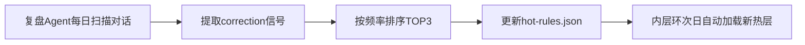

# 🤖 Dual-Ring Gate（双环门禁）

> **让你的AI不再"忘记"自检——不是提醒它做，而是不让它跳过。**

[](https://hermes-agent.nousresearch.com/)
[](https://opensource.org/licenses/MIT)
[](http://makeapullrequest.com)

---

## 🎯 一句话

所有AI自检机制都依赖"AI记得去执行它"——但"记得去执行自检"这件事本身，没有自检。

**双环门禁补的就是这个元层漏洞。**

---

## 🔥 为什么你需要它

如果你使用AI Agent（Claude Code、Cursor、Hermes Agent等），你一定遇到过：

| 场景 | 你花的代价 |
|:-----|:----------|
| AI犯了一个错，你纠正了，它也记住了 | 你花时间教了 |
| 第二天新会话，AI又犯了同样的错 | 你再花时间教一次 |
| 你建立了规则库、检查清单、记忆系统 | 你花心思设计了 |
| AI说"好的记得了"——然后**又跳过自检了** | 你开始怀疑AI能不能真的学会 |

**问题不在AI不聪明，在"自检"和"执行"之间隔了一层"记得"。**

---

## 🏗️ 架构：双层强制 + 动态生命周期

### 外层环 · Shell门禁（零token · 不可跳过）

由shell脚本在AI启动前强制执行。不依赖AI"记得"——它根本没机会开口。

```bash
# pre-session-check.sh
date '+%Y-%m-%d %H:%M'           # 时间确认
hermes gateway status            # 网关检查（cron调度器）
```

如果Gateway没启动 → shell脚本直接启动它 → 启动失败 → 会话拒绝启动。

### 内层环 · Prompt固化（~50token · 不可删除）

3条最高优先级的指令写入 `SOUL.md`，每次会话自动注入system prompt。AI可以在思维链中忽略它，但**无法删除这个载体**。

```markdown
## 🔴 双环门禁·内层环（不可跳过）
- 每次回复前先 terminal('date') 确认时间
- 本日首次回复前检查 gateway 状态
- 修复后必须更新ERR规则
```

### 热/温/冷三层 · 规则生命周期（动态调整）

规则不是永久的——它们会老、会死。

```
🔥 热层（3天内被纠正过）     → 自动进入内层环
🌤 温层（累计复发≥2次）      → 按需加载
❄️ 冷层（>7天无复发）        → 仅手动查询
🗑️ 退役（30天无复发）        → 归档
```

如果某条规则已经退役，但又复发了 → **罚性反弹**：直接回到热层，不走温层。

---

## 🆚 与众不同的地方

| 对比维度 | 其他方案（LangGraph/NeMo/Cursor） | **双环门禁** |
|:---------|:---------------------------------|:-------------|
| **强制层数** | 单层（要么prompt、要么shell） | **双层**（shell+prompt，互不依赖） |
| **规则生命周期** | ❌ 静态——写进去就永远在那 | ✅ **动态**——无人触碰自动降级/退役 |
| **安装成本** | 部署一个中间件服务器、改框架代码 | **3分钟**，一个skill + 一段SOUL.md |
| **token开销** | 全量规则每次加载 | **分层按需**，热层仅~50token |
| **依赖外部反馈** | 依赖专门的监控系统 | ✅ **无依赖** ——你说一句"我最近总犯X"就更新热层 |
| **复用已有数据** | ❌ 另起炉灶 | ✅ **一鱼多吃**——和复盘Agent联动，复用已有correction信号 |

**简单说：别人做的是"你犯错→你写规则→规则钉在那"，我们做的是"你犯错→规则进热层→不犯了自动退役"。**

---

## ⚡ 快速安装

### 方式一：一行命令安装

```bash
hermes skills install https://raw.githubusercontent.com/Ghl211/skills-introduction-to-github/main/AI-skill/dual-ring-gate/SKILL.md
```

### 方式二：一键脚本

```bash
curl -fsSL https://raw.githubusercontent.com/Ghl211/skills-introduction-to-github/main/AI-skill/dual-ring-gate/scripts/install.sh | bash
```

### 方式三：手动（3步，2分钟）

1. 把 `AI-skill/dual-ring-gate/SKILL.md` 复制到 `~/.hermes/skills/knowledge/dual-ring-gate/`
2. 把内层环3条指令追加到 `~/.hermes/SOUL.md`
3. 把 `hot-rules.json` 放到 `~/.hermes/flywheel/`，填上你最常犯的3个错误

---

## 📖 使用方式

### 🟢 新手模式（即装即用）

装好就有外层环+内层环兜底，不需要任何额外配置。

### 🟡 进阶模式（养自己的规则）

当AI犯了一个新错误，你只需要说一句：

> "我总是不check时间就说话，把它放热层。"

AI会自动更新 `hot-rules.json`，把这条规则放入热层。30天没再犯，它自动退役。

### 🔴 专家模式（接入复盘Agent）

如果你有自己的对话复盘Agent（如齿轮B），它可以每天自动扫描对话中的correction信号，自动更新热层。



---

## 📂 项目结构

```
AI-skill/dual-ring-gate/
├── SKILL.md                    ← 主技能文件（hermes skills install 入口）
├── scripts/
│   ├── pre-session-check.sh    ← 外层环Shell门禁
│   └── install.sh              ← 一键安装脚本
└── templates/
    └── hot-rules.json          ← 热层规则模板
```

---

## 🤝 参与贡献

这是一个开源项目，欢迎：

- ⭐ Star 鼓励
- 🐛 提交 Issue 报告问题
- 🔀 提交 PR 改进代码
- 💡 分享你的使用案例和经验

---

## 📜 许可证

MIT License — 自由使用、修改、分发。

---

## 👥 关于

由 [@Ghl211](https://github.com/Ghl211) 和维护。受到自进化方法论（五步法：感知→分析→决策→执行→反馈+记忆）启发，将"规则执行门禁"从方法论层面的概念落地为可安装的Hermes技能。

> *"你投进系统里的每一次纠正，不应该清零——它应该折旧，但不是白费。"*
