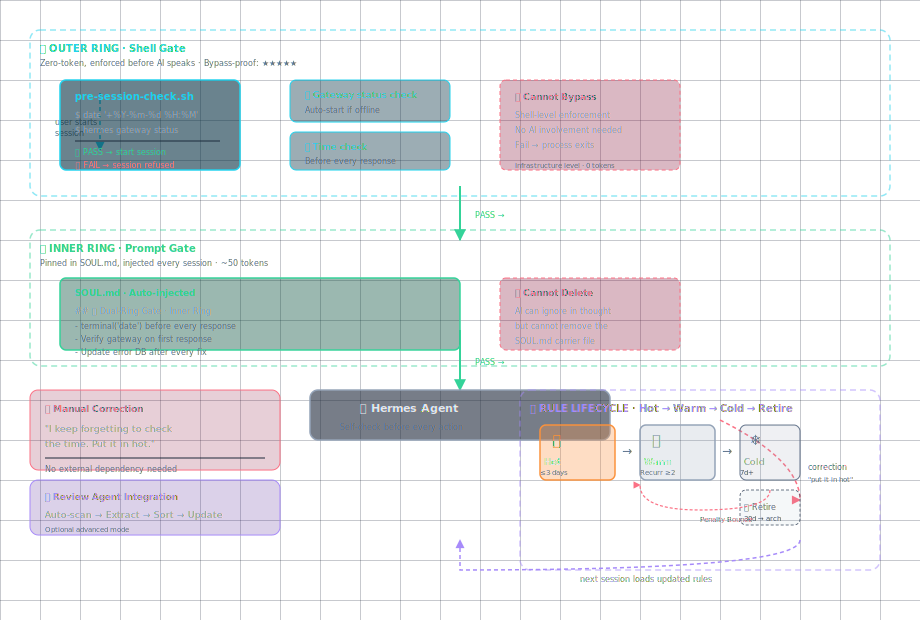

<p align="center">
  <h1 align="center">🤖 Dual-Ring Gate（双环门禁）</h1>
  <p align="center">
    <em>让你的 AI 不再"忘记"自检——不是提醒它做，而是不让它跳过。</em>
  </p>
  <p align="center">
    <a href="https://github.com/Ghl211/skills-introduction-to-github/stargazers">
      
    </a>
    <a href="https://github.com/Ghl211/skills-introduction-to-github/blob/main/LICENSE">
      
    </a>
    <a href="https://hermes-agent.nousresearch.com/">
      
    </a>
    <a href="https://raw.githubusercontent.com/Ghl211/skills-introduction-to-github/main/AI-skill/dual-ring-gate/SKILL.md">
      
    </a>
    <a href="https://github.com/Ghl211/skills-introduction-to-github/pulls">
      
    </a>
  </p>
  <p align="center">
    <a href="README.md">English</a> | <a href="README_CN.md">中文</a>
  </p>
</p>

---

## 🎯 一句话

所有 AI 自检机制都依赖"AI 记得去执行它"——但"记得去执行自检"这件事本身，没有自检。**双环门禁补的就是这个元层漏洞。**

---

## 🔥 为什么你需要它

如果你使用 AI Agent（Claude Code、Cursor、Hermes Agent 等），你一定遇到过：

| 场景 | 你花的代价 |
|:-----|:----------|
| AI 犯了一个错，你纠正了，它也记住了 | 你花时间教了 |
| 第二天新会话，AI 又犯了同样的错 | 你再花时间教一次 |
| 你建立了规则库、检查清单、记忆系统 | 你花心思设计了 |
| AI 说"好的记得了"——然后又跳过了自检 | 你开始怀疑 AI 能不能真的学会 |

问题不在 AI 不聪明，在"自检"和"执行"之间隔了一层"记得"。

---

<p align="center">
  
</p>

---

## ⚡ 快速安装

```bash
hermes skills install https://raw.githubusercontent.com/Ghl211/skills-introduction-to-github/main/AI-skill/dual-ring-gate/SKILL.md```

装完重启 Hermes 会话即可生效，无需任何额外配置。

---

## 🏗️ 架构：双层强制 + 动态生命周期

### 外层环 · Shell 门禁（零 token · 不可跳过）

由 shell 脚本在 AI 启动前强制执行。不依赖 AI"记得"——它根本没机会开口。

```bash
# pre-session-check.sh
date '+%Y-%m-%d %H:%M'           # 时间确认
hermes gateway status            # 网关检查
```

如果 Gateway 没启动 → shell 脚本直接启动它 → 启动失败 → 会话拒绝启动。

### 内层环 · Prompt 固化（~50 token · 不可删除）

3 条最高优先级的指令写入 `SOUL.md`，每次会话自动注入 system prompt。AI 可以在思维链中忽略它，但无法删除这个载体。

```markdown
## 🔴 Dual-Ring Gate · Inner Ring (auto-injected · cannot skip)
- **Time check**: terminal('date') before every response
- **Gateway check**: verify gateway status on first response
- **Rule update**: every fix must also update the error rule database
```

### 热/温/冷三层 · 规则生命周期（动态调整）

规则不是永久的——它们会老、会死。

| 层 | 条件 | 说明 |
|:---|:-----|:-----|
| 🔥 **热层** | 最近 3 天内被纠正过 | 自动进入内层环，每次会话可见 |
| 🌤 **温层** | 累计复发 ≥ 2 次 | 按需加载，不占热层位置 |
| ❄️ **冷层** | 超过 7 天无复发 | 仅手动查询，不自动加载 |
| 🗑️ **退役** | 30 天无复发 | 自动归档，不再占用任何空间 |

如果某条规则已经退役，但又复发了——**罚性反弹**：直接回到热层，不走温层。

---

## 🆚 与众不同的地方

| 对比维度 | 其他方案（LangGraph / NeMo / Cursor） | 双环门禁 |
|:---------|:--------------------------------------|:---------|
| 强制层数 | 单层（要么 prompt、要么 shell） | 双层（shell + prompt，互不依赖） |
| 规则生命周期 | 静态——写进去就永远在那 | 动态——无人触碰自动降级、退役 |
| 安装成本 | 部署中间件服务器、改框架代码 | 3 分钟，一个 skill + 一段 SOUL.md |
| token 开销 | 全量规则每次加载 | 分层按需，热层仅 ~50 token |
| 依赖外部反馈 | 需要专门的监控系统 | 无依赖——你说一句"把它放热层"就更新 |
| 复用已有数据 | 另起炉灶 | 一鱼多吃——可与复盘 Agent 联动 |

简单说：别人做的是"你犯错→你写规则→规则钉在那"，我们做的是"你犯错→规则进热层→不犯了自动退役"。

---

## 📖 使用方式

### 🟢 新手模式（装好即用）

装好就有外层环 + 内层环兜底，不需要任何额外配置。下次新会话自动生效。

### 🟡 进阶模式（养自己的规则）

当 AI 犯了一个新错误，你只需要说一句：

> "我总是不看时间就说话，把它放热层。"

AI 会自动更新 `hot-rules.json`，把这条规则放入热层。30 天没再犯，它自动退役。

### 🔴 专家模式（接入复盘 Agent）

如果你有自己的对话复盘 Agent，它可以每天自动扫描对话中的纠正信号，自动更新热层：

```
复盘 Agent → 提取纠正信号 → 按频率排序 TOP3 → 更新 hot-rules.json → 内层环次日自动加载新热层
```

---

## ✅ 验证是否生效

新开一个 Hermes 会话，看 system prompt 中是否有以下 3 行：

```
## 🔴 Dual-Ring Gate · Inner Ring (auto-injected · cannot skip)
- **Time check**: terminal('date') before every response
- **Gateway check**: verify gateway status on first response
- **Rule update**: every fix must also update the error rule database
```

有 → 生效了。没有 → 检查 `~/.hermes/SOUL.md` 是否已追加。

---

## ⚙️ 触发方式

| 组件 | 触发条件 | 自动程度 |
|:-----|:---------|:--------:|
| **内层环**（SOUL.md） | 每次新会话开始 | ✅ 自动——SOUL.md 由 Hermes 每次注入 system prompt |
| **外层环**（shell 脚本） | 每次启动 Hermes 之前 | ✅ 自动——配置 shell alias 后，不跑脚本不让进会话 |
| **热层更新**（hot-rules.json） | 你纠正 AI 时 | 🔄 手动或自动——你说一句"把它放热层"，或复盘 Agent 自动更新 |

---

## 📦 安装方式

### 方式一：一行命令

```bash
hermes skills install https://raw.githubusercontent.com/Ghl211/skills-introduction-to-github/main/AI-skill/dual-ring-gate/SKILL.md```

### 方式二：一键脚本

```bash
curl -fsSL https://raw.githubusercontent.com/Ghl211/skills-introduction-to-github/main/AI-skill/dual-ring-gate/scripts/install.sh | bash```

### 方式三：手动（3 步，2 分钟）

1. 把 `AI-skill/dual-ring-gate/SKILL.md` 复制到 `~/.hermes/skills/knowledge/dual-ring-gate/`
2. 把内层环 3 条指令追加到 `~/.hermes/SOUL.md`
3. 把 `hot-rules.json` 放到 `~/.hermes/flywheel/`，填上你最常犯的 3 个错误

---

## 📂 项目结构

```
AI-skill/dual-ring-gate/
├── SKILL.md                    ← 主技能文件（hermes skills install 入口）
├── scripts/
│   ├── pre-session-check.sh    ← 外层环 Shell 门禁
│   └── install.sh              ← 一键安装脚本
└── templates/
    └── hot-rules.json          ← 热层规则模板
```

---

## 🤝 参与贡献

欢迎参与！⭐ Star · 🐛 Issue · 🔀 PR · 💬 分享

---

## 🌐 社区

- **Issues**：[github.com/Ghl211/skills-introduction-to-github/issues](https://github.com/Ghl211/skills-introduction-to-github/issues)
- **Discussion**：GitHub Discussions
- **Hermes Discord**：[discord.gg/hermes-agent](https://discord.gg/hermes-agent)

---

## 📜 许可证

MIT License。自由使用、修改、分发。

---

## 🆕 v1.1 新增特性（2026-07-03）

| 特性 | 解决的问题 |
|:-----|:----------|
| **每次回复前自动加载热规则** | 规则在15轮对话后被挤出上下文的问题 |
| **会话中段时间保鲜** | 时间数据5分钟/3次工具调用后自动过期，强制重新date |
| **纠正→热规则反馈链** | 每次被纠正时自动更新 hot-rules 的 last_correction 和 days_active |
| **内层环添加检测关键词** | 从"记得检查时间"改为"看到这些词→必须date" |

---

